# FastAPI를 이용한 백엔드 프로젝트

- Python의 FastAPI를 이용해 웹 서버와 데이터베이스를 구축해보고  
이를 통해 백엔드 인사이트를 얻기 위해 기획되었습니다. 

 

# 전체 프로젝트 구조

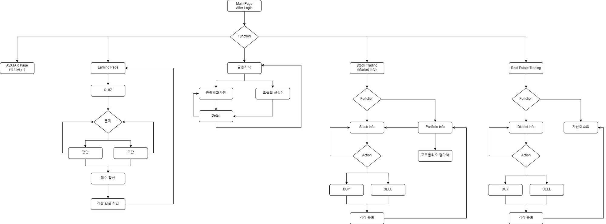
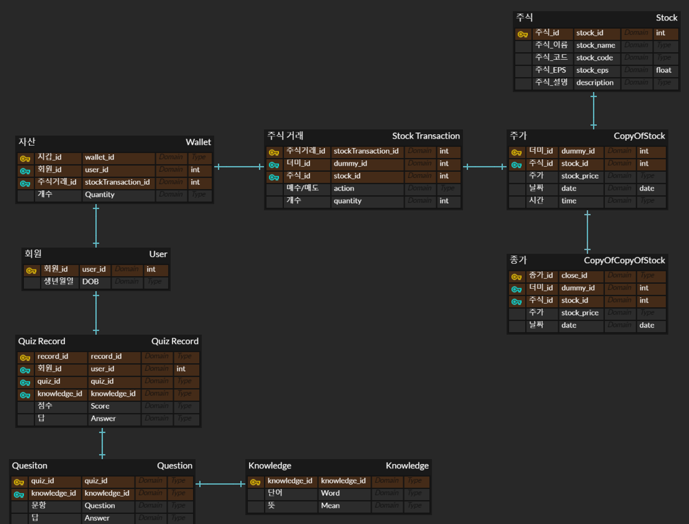

 

## 백엔드 구조

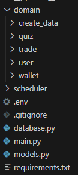

 

<b>domain<b>

  
<b>create_data : 사용자 행동의 기반이 되는 주식 데이터 ETL</b>

  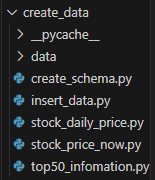

  - data : MySQL에 적재하기 전 Raw Data
  - create_schema.py : MySQL에 생성할 테이블 스키마 정보
  - insert_data.py : 정제된 데이터를 스키마에 맞춰 적재
  - stock_daily_price.py : 수집하고자 하는 기업의 종목코드를 리스트로 만들고 시작일과 종료일을 입력하여 해당 기간 동안의 일봉 데이터 수집
  - stock_price_now.py : 수집하고자 하는 기업의 종목 코드를 리스트로 만들고, 수집 시점의 현재가를 시간데이터와 함께 수집
  - top50_information.py : 한국투자증권 API와 DART openAPI를 이용, 코스피와 코스닥 시가총액 상위 25개씩 총 50개 기업의 재무정보 수집

  
<b>quiz : 경제 퀴즈 관련 CRUD</b>

  
  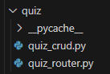

  - quiz_crud.py : 입력한 숫자에 해당하는 난이도의 문제를 무작위로 1개 출력
  - quiz_router.py : 무작위로 출력된 문제를 풀었을 때, 로그인한 유저의 cash가 증가하고 틀렸을 때에는 문제의 힌트가 출력

  
<b>trade : 주식 거래 관련 CRUD</b>

  
  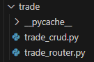

  - trade_crud.py
    - buy_stock : 기업코드와 수량을 입력했을 때 유저의 cash 잔액이 충분하다면 금액과 수량을 각각 wallet과 portfolio 테이블에 반영
    - sell_stock : 기업코드와 수량을 입력했을 때 유저의 portfolio에 있는 주식 수량이 충분하다면 금액과 수량을 각각 wallet과 portfolio 테이블에 반영
    - eval_stock : 함수를 실행한 당시의 현재가를 기준으로 유저의 portfolio 테이블에 있는 모든 주식의 가치를 계산하여 wallet 테이블에 반영
  - trade_router.py : 주식을 거래할 때마다 총 주식 평가액을 재계산하여 반영

  
<b>user : 유저 정보 관련 CRUD</b>

  
  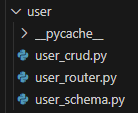

  - user_crud.py : 유저가 입력한 정보로 회원가입 및 관련 db 생성
  - user_router.py : 로그인, 로그아웃, 현재 유저 정보 출력
  - user_schema.py : validator를 이용해 유효성 검사 진행

wallet : 유저의 자산 정보 업데이트  
 
scheduler : 주식의 장중 가격을 주기적으로 업데이트  
database.py  
main.py  
models.py

## API 문서 / DB

  
<b>/user/create</b>

  
  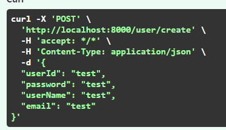
   

  - ID, 비밀번호, 이름, 이메일을 입력 받아 유효성 검사를 진행

  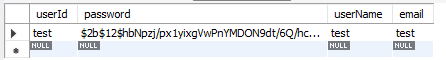
  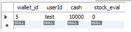
  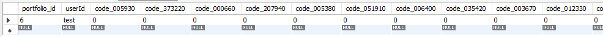
   

  - 가입이 완료되면 DB에 유저정보/자산/포트폴리오 테이블이 생성,
  비밀번호는 암호화되어 유저정보에 저장되고 쿠키에 접속 정보 저장

  
<b>/user/login</b>

  
  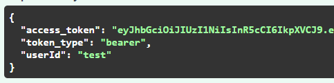
   

  - ID와 비밀번호를 입력하면 DB와 대조하여 로그인 진행 로그인에 성공하면 jwt 토큰값 반환

  
<b>/user/current_user</b>

  
  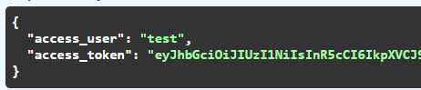
   

  - 쿠키에 저장된 유저정보와 토큰값을 반환

  
<b>/quiz/random</b>

  
  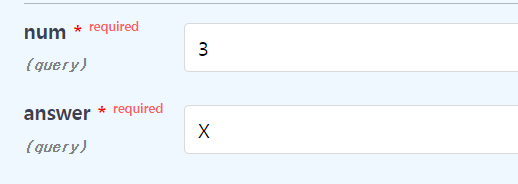
  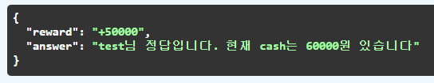
  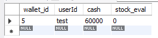
  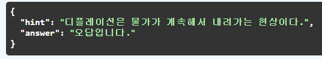
   

  - 선택한 난이도에 해당하는 숫자와 답을 입력하면 정답일 경우 로그인한 유저의 자산에 cash 추가, 오답일 경우 문제의 힌트 출력

  
<b>/trade/trade</b>

  
  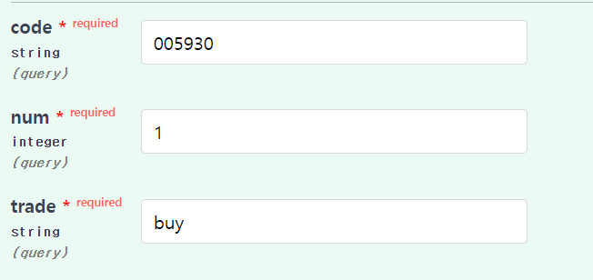
  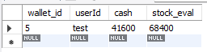
  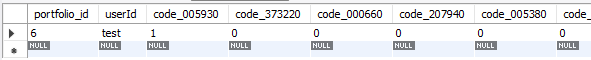
  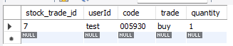
   

  - 거래하고자 하는 주식의 코드 / 수량 / buy, sell을 입력했을때 자산에 cash가 충분하다면 거래가 진행되고 포트폴리오와 거래 원장에 반영

  
<b>/trade/eval</b>

  
  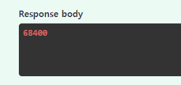
   

  - 현재 접속한 유저의 총 주식평가액을 출력

 

 

# Tech Stack

## FastAPI

> 이 기술을 프로젝트에 선택한 이유는?
> 
- rest api개발이 처음이었고 3주라는 한정된 기간 내에 구현해야 했던 만큼, 코드 작성이 간단하고 배우기 쉬우며 버그가 적다는 점에서 적합하다고 판단하였다.

> 사용하면서 어려웠던 점과 해결한 과정
> 
- 관련 레퍼런스가 적어 퀵스타트 예제를 벗어나는 기능은 구현하는 데 어려움이 있었다. rest api에 대해 복습을 하고 유닛 테스트를 통해 crud가 어떻게 적용되는지 숙달되면서 해결하였다.

 

## MySQL

> 이 기술을 프로젝트에 선택한 이유는?
> 
- 해당 프로젝트는 주된 데이터가 추후에 확장되기보다, 데이터의 구조가 명확한 정형 데이터라고 판단하였다. 따라서 RDBMS는 데이터를 2차원 테이블 형태로 관리할 수 있다는 점에서 적합하다고 판단하였다.

> 어떻게 사용했는가?
> 
- schema를 작성하고 기본 데이터를 입력할 때에는 python의 mysqldb 라이브러리를 사용해 SQL을 직접 작성하였고 FastAPI 상에서 데이터를 전송할 때에는 ORM 기반의 sqlalchemy 라이브러리를 이용하였다.